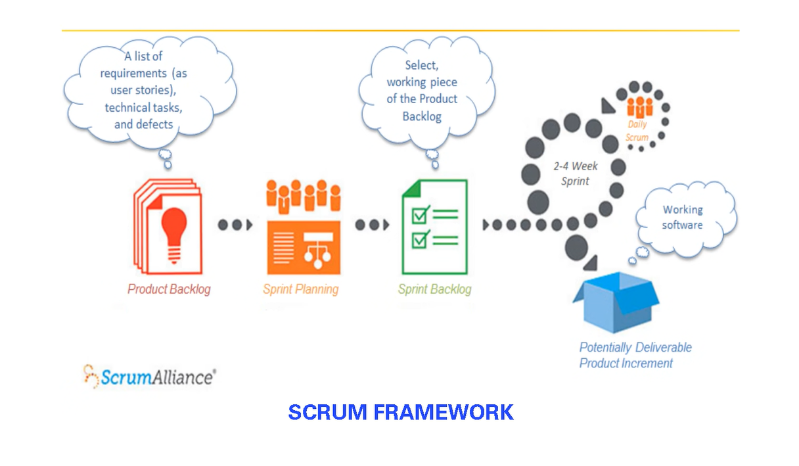
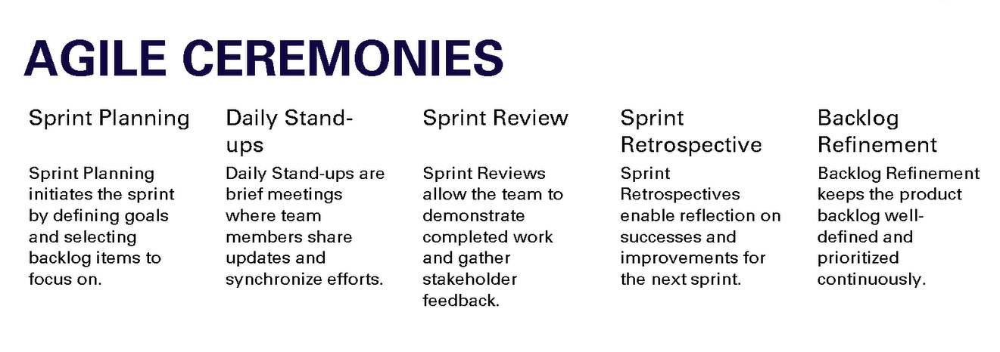
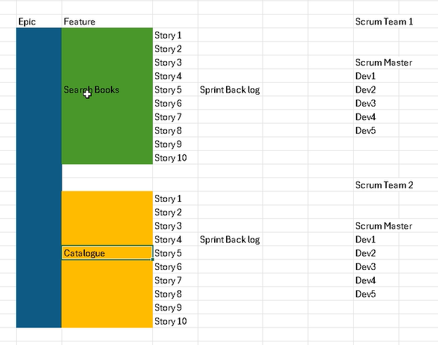
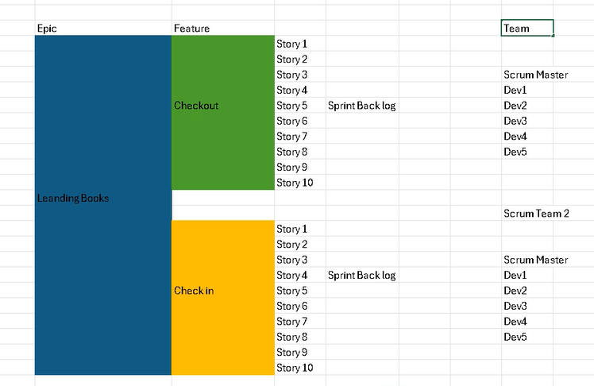
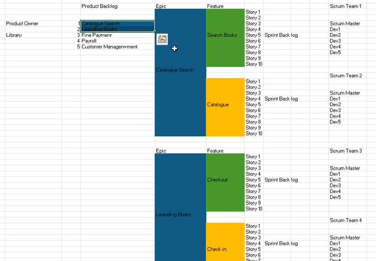
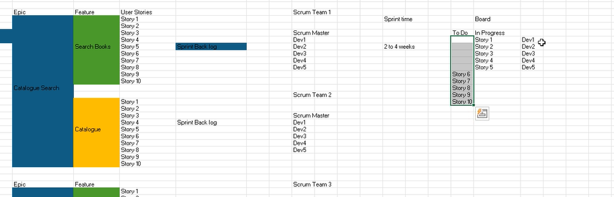
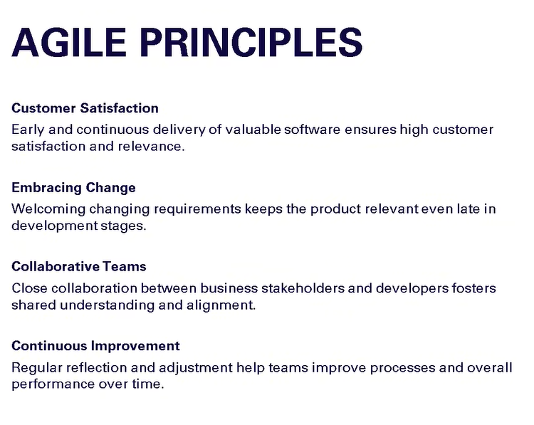
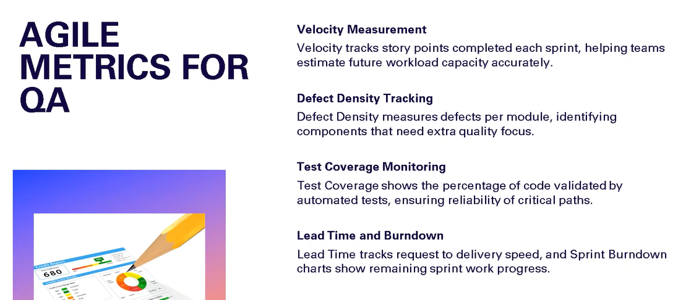

# Agile Notes
## Watefall Model
Requirements -> Design -> Programming -> Testing -> Deployment -> Maintenance
This was done earlier.
Cons:
Compromise of quality.

## What is Agile?
Agile is an appraoch that divides work into phases, emphasizing **continous delivery and improvement**. The Agile methodology benefits teams by enabling adaptive planning, rapid execution, and ongoing evaluation, leading to more responsive and successful outcomes.
Major players are Scrum and Kanban.

### Agile ceremonies
Sprint planning - capacity planning, story estimation
Daily standup/scrum call/scrum meeting
Sprint demo
Sprint retrospection (what went well, what didnt went well)

Example: 2 Weeks 4 Dev 1 QA
40*2 hours, 8hrs per day.
If there are holidays, scrum master will do story estimation.

Story estimation - fibonacci 1, 2, 3, 5, 8 or sizing s, m, l, xl, xxl.
Story point

Architect will explain each story to teams.

User story -> description and acceptance criteria(based on acceptance critieria, testers will test).

### Scrum
Scrum follows Agile.
Iteration based. To achieve iteration, we use sprints (like 3 weeks or more or less).
Small functionality will be shown to client during each iteration.

#### PI(Program Increment) planning in scrum
6hrs of meeting. 6 months of release.
PI -> Deciding on the prioritized feature/epic. There will n number of user stories under it, eg. Design registration form. (subtask)
They will add these features to **Release back log.**
A large scale planning event with Client, all stakeholders.
Sprint team names will be like unicorn, lion etc.
All sprint teams will be having their breakout session, in this they will decide which feature should be added to which iteration.

#### Scrum Lifecycle
Product back log -> contains all features.
Release back log
Sprint back log
Backlog items

## Roles
Product Owner, Scrum master, Team.

Product owner will reach out to client and explain the functionality of a feature, if you have any doubt on a feature, you can ask them.
He knows functionalities, not agile.

Scrum master doesnt assign tasks, he only facilitates.
He doesnt need to do functionalities, he just knows agile.

Team is responsible to understand user stories.
If team has 5 peoples, there will be like 4 Dev and 1 QA.
Scrum master wont supervise the teams, its the responsibility of teams.

Sprint Team - 1 scrum master, 3 dev, 1 qa. All are req to have all the skills in agile.

Sprint planning: typically 1 and 1/2 hours.
In product backlog there will be list of user stories. They will categorize based on modules (Like product catelog module, checkout module). Product owner builds product backlog for two modules.
Agile teams will split the modules and take one for each.

Each sprint will be for 2-4 weeks. Mostly 2.
They will plan in such a way that, within 2 weeks they can ship it out (a working software).

Sprint backlog

Product backlog - modules 5, search function

Which feature should be built first will be defined by the product owner.

They can search by author, genre, they will explain in high level.
sprint team work on catelog building fucn, catelog should have these many books so we need this database, (all the technical aspects will go in sprint backlog, which software is good to use).

Product backlog will have functional req

Sprint backlog very small, should be compplted in 2 weeks. technical req.

Release backlog: 
Eg. Banking sol
Lot of modules will be there.
Concept: Safe agile.

Release train engineer will tell I want these many modules to be released withink these many months.

They will have their own backlog.

Agile Ceremonies:

Facilitated by Scrum master.

Sprint Team, they will order user story in a feature based on priority. Like story 1 will be database creation. story 3 will be adding data to db.

Eg. Lets say 10 stories is chosen by sprint team.

Both Search Books and Catalog are one Epic. (allows to search books)

If Dev1 completes a story in 2 days, he can assign a new story to himself and work on it.

Story Estimates:
Story Point: For each story we have in backlog, there will story point.
How they come with story points?
Decided in sprint planning using Planning Poker. (Scrum master will run this poker meeting).
Devs will give story point via fiboannic series. 1 - 8(max complexity).
Each dev will write a point in poker card and reveal and explain the reason and will come up with a story point.

1st day of every spring, there will be sprint planning and decide on who can take what.

For next 2 weeks, every day will have STAND UP. Devs will answer questions like What they worked on? What they will do today? Are there any block that will prevent them from doing it today?

Scrum master conducts the meeting.

Scrum master must immediately seek what is the blockage, and find if its a technical blockage or requirement blockage. If its a requirement blockage, they will ask Product owner and sort it out.

Sprint Review 

Sprint Retrospective happens even after the demo.
eg. Dev1 will tell Dev2 helped him etc.
They will mention positive and negatives things happened in the sprint.

Backlog Refinement: Grooming req. Breaking down next modules.

Agile Manifesto:
https://agilemanifesto.org/

12 Principles of Agile:
How the 12 principles in the Agile Manifesto work in real life | Scrum.org