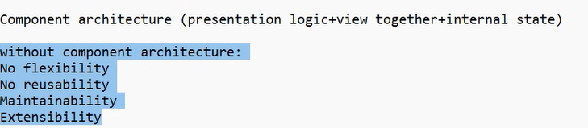
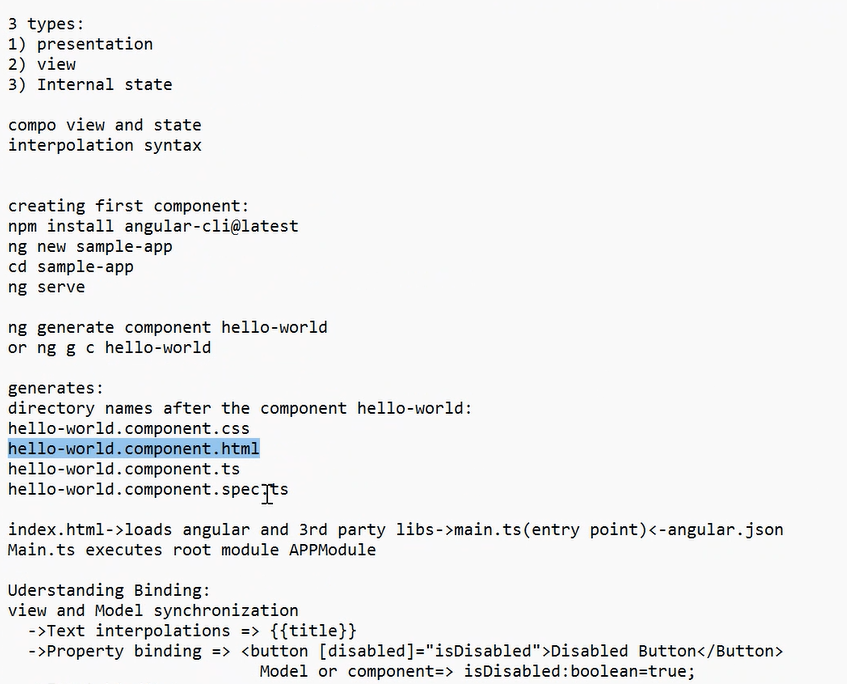
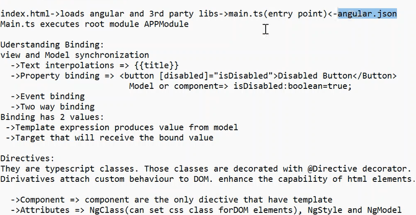

# Angular Notes
MVC Architecture.

commands:
1. ng-app = "myApp"
2. ng-init = "a=5,b=6;"
3. ng-bind = "a+b" (or) {{a+b}}
4. ng-repeat = "number in numberList" {{number}}
5. ng-controller
6. ng-show, ng-hide
7. [(ngModel)], [(ngValue)]

5. ng-controller:
index.html:
```
<div ng-controller = "MyController">
    {{name}}
</div>
```
    scope of MyController is within the div tag.

app.js:
```
var app = angular.module('myApp', []);
app.controller('MyController', ['$scope', function($scope) {
    $scope.name = 'Ross';
}])
```
    $scope - js object which allows to use data between controller and view.

6. ng-show:
<p ng-hide="isSpy">Real Name</p>
<p ng-show="isSpy">Code Name</p>
    isSpy is a boolean set to true.

## Filters:
uppercase, lowercase, currency, limitTo: 3 (restrict no of char), orderBy: '-salary' (desc order), 

{{name | uppercase}}

# 30-0-2025:
Tech before: each http response, the dom will refresh. Its slow to render page each time. (Single Page Application - SPA)

It will send only the data(JSON), not the complete view. Done in asynchronous programming. Java supports asynchronous.

DOM will not get refreshed, whatever data is needed will be retrieved.

DOM manipulation is done for SPA.

AJAX - Asynchronous Javascript And XML.

Angular leverages DOM manipulation to achieve SPA.

Angular is a Component based architecture.



Component holds all the business logic.



Component:
selector: a tag, to use this component else where.
imports: name of imported components.

Binding: synchronize between model and view.
