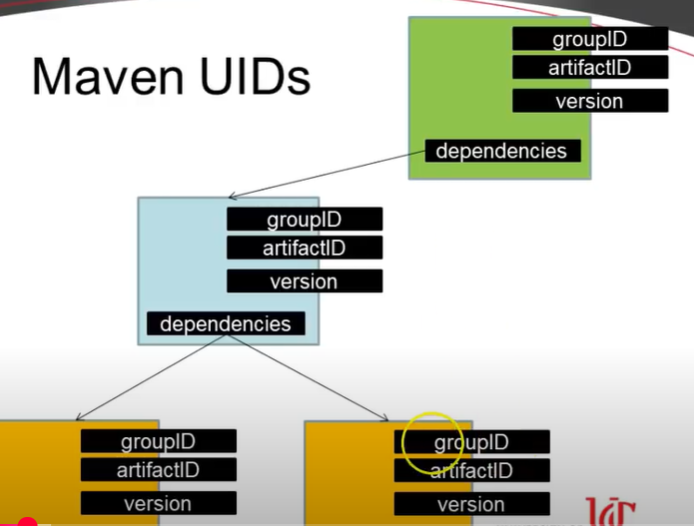
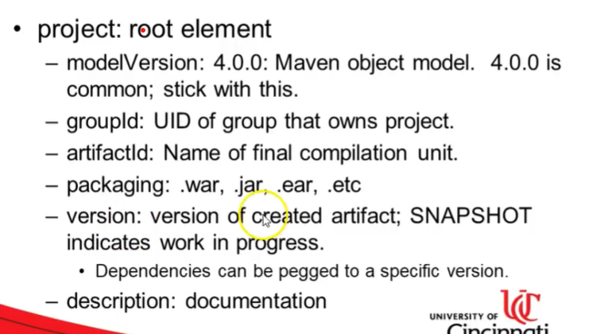

# Maven Notes
It is a build automation tool.

Sample.java >>javac Sample.java --compile--> Sample.class (bytecode) --run--> >>java Sample

https://youtu.be/KNGQ9JBQWhQ?si=xQQynIheD8NsrIQd

1) Maven (xml based)
2) Ant (xml based)
3) Gradle (json based)

Manages
    -- builds
    -- dependencies + versions
    -- documentation

Fetches from internet and stores locally. Checks locally for dependency before searching the internet.

Why Maven?
    -- Central repo for dependencies (can just copy dependency code and paste in pom file)
    -- Transitive dependency(dependency hierarchy): Just mentioning a dependency will pull all its dependency as well.

Maven Building Blocks
    -- Goals
        -- Tasks that do the work
        -- Defined by plugin
        -- mvn compiler:compile (plugin: compiler, goal: compile)
    -- Plugins
        -- Nearly everything in maven
        -- Extends Maven
        -- More goals
        -- They are dependencies that need to be downloaded before use

Maven Lifecycle
https://medium.com/@venkatravuru6564/%EF%B8%8F-maven-lifecycles-explained-simply-with-example-flowchart-b83dffdc0dbb
    -- Validate
    -- Compile
    -- Test
    -- Package
    -- Verify
    -- Install
    -- Deploy

Maven Goals
    -- compiler:compile – the compile goal from the compiler plugin is bound to the compile phase
    -- compiler:testCompile is bound to the test-compile phase
    -- surefire:test is bound to the test phase
    -- install:install is bound to the install phase
    -- jar:jar and war:war is bound to the package phase

Maven UIDs
    -- Can set up dependency tree using unique identifier.
    
    -- We label our own UID, and we can use other's UID to bring in dependencies.
    -- UID: groupID, artifactID, version
    -- Artifacts are stored in user/.m2 folder. (When we do maven update, it downloads and stores dependency here).

pom.xml
    
    -- parent: pom.xml inherits from here. Eg: springframework with groupID, artifactID, version.
    -- dependency: pom.xml depends on these. Eg. JUnit library with groupID, artifactID.

