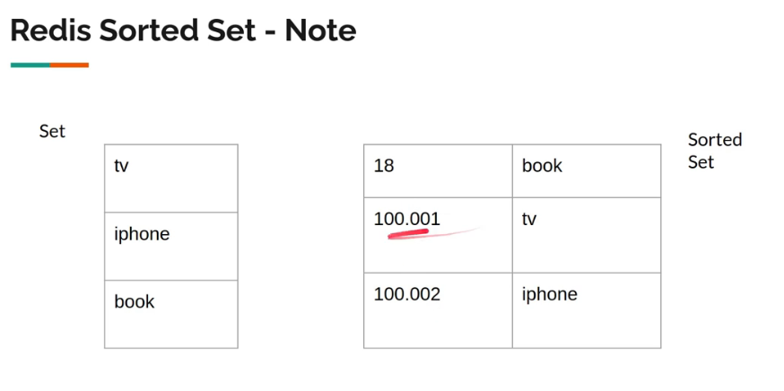
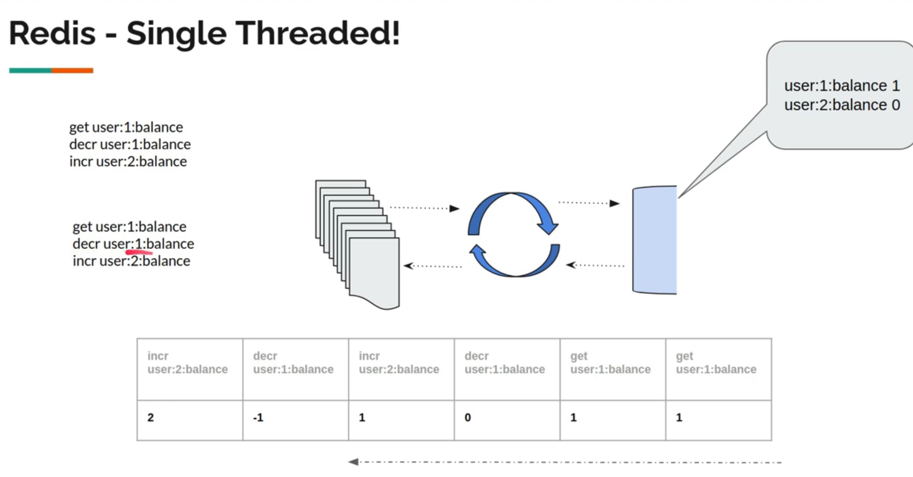

## Spring Websocket Notes:
User -> Shipping Service -> Fed Ex API
If user give 1000 requests, for each request our backend Shipping service will call Fed Ex API 1000 times, which overloads the endpoint.

## Redis:
In-Memory DB (NoSQL).
512 MB Max size.
Max 2^32 keys
    list, set can hold 2^32 inside them
Everything is a string.
Useful to share information between microservices.
Syntax: set/get {variable name} {value} {options}
```
set a b
get a -> "b"
get c -> nil
set a 1
get a -> "1"
set a "b c d"
get a -> "b c d"
```
Since everything is a String in redis and there is no concept of table, you can follow your own standard like:

set user:1:name sam

id  name
1   sam     -> /user/1/name (or) /user/name/1
2   jake

### search:
```
keys * -> shows all keys (will affect performance of application)
keys user* -> matching the pattern
scan 0 -> gives all the keys(it will give only 10 keys per page, not all keys in same page), newer than keys.

scan 0 MATCH user* -> pattern matching
scan 0 MATCH user* count 3 -> like LIMIT 3
```

### delete:
```
del user:8:name user:10:name
flushdb -> delete all
doesnt accept pattern like del user*
```

### Expiring Keys:
```
set a b ex 10 -> expiry in 10 seconds
ttl a -> time to leave, returns remaining seconds
expire a 60 -> set new expiry
set a b exat 1624737950 -> will expire at the timestamp.

set a b px 3000 -> millis
set a c -> will delete time too.
set a c keepttl -> will keep the ttl
```

### xx and nx:
```
set a b xx -> (present) if a is present, do a = b.
set a b nx -> (not present) if a not present, do set a b.
set a c nx -> will return nil because a already present.
```

### exists:
```
exists a -> returns 1 (or) 0.
```

### incr, decr:
```
set a 1
incr a -> will parse string to interger and increment. (Wont work for strings, like a = b).
incr b -> create b = 0 and increment to 1.
incrby a 20 -> increase by 20.
decr b
decrby b 20 -> decr by 20.

incrbyfloat a .3 -> incr for float.
incrbyfloat a -.3 -> decr for float.
```

### Hash:
Structure:
variable name: redis key name
variable value: redis value
    hashmap key : hashmap value

Cant use get for complex data types like this.
```
hset {variable name} {field} {value} ...
hset user:1 name sam age 10 city atlanta
type user:1
hget user:1 name >> sam
hget user:1 age >> 10
hgetall user:1
expire user:2 -> cant expire one field within hash.
hexists user:1 age
hdel user:1 age
del user:1
```

### List:
Cant use get.
Can use it as stack or queue.
```
rpush users 1 2 3 4 5 6 7
llen users -> list length (llen)
lrange users 0 -1 -> shows all items if -1 is given.
lpop users >> 1 (1st elem) (left pop)
lpop users 2 >> 2 3 (pop 2 elems)
rpop users >> 7 (right pop)
```

If there are no elements, redit wont store an empty redis variable name.

### Set:
O(1) time complexity.
No order.
```
sadd users 1 2 3
srem users 1 -> remove elem
scard users -> size of the set.
smembers users >> 2 3
sismember users 5 -> check if 5 is in set.
spop users -> randomly removes a elem.
```

#### Intersection, Union, Difference:
```
sadd skill:java 1 2 3 4
sadd skill:js 2 3 4
sadd skill:aws 4 5 6
sadd candidate:criminal 4 5 6

sinter skill:java skill:js skill:aws >> 4 (one who has all the skills)

sunion skill:java skill:js >> 1 2 3 4 (one who has either java or js skill)

sdiff skill:java candidate:criminal >> 1 2 3 (A - B)

sinterstore knows-java-js skill:java skill:js -> do intersection and store it in knows-java-js set
```

The numbers are called ranks. If there are two elem with same rank, it is ordered by alphabetical order.

### Transactions:
Redis is single threaded.
Requests are queued.

Multiple request/commands can be queued in random order and cause trouble.

This is why we use Transaction. Series of commands that are grouped. If it fails, it rolls back, deleting all changes made by the entire group.

```
set user:1:balance 1
set user:2:balance 0

watch user:1:balance user:2:balance

multi -> to enter into Transaction mode.
decr user:1:balance -> commands will be queued.
incr user:2:balance
exec >> 0 1

watch user:1:balance user:2:balance -> when someone else modified these keys at the same time, it reverts the transaction. So:

multi
decr user:1:balance
incr user:2:balance
exec >> nil -> this is executed after another block already executed.

after exec is completed, watch will be closed.

discard -> to get rid of a currently queued transaction.
```

### Saving Data on Disk:
There is auto save onto disk.

To explicity store:
```
bgsave -> uses another thread to save in disk.
```