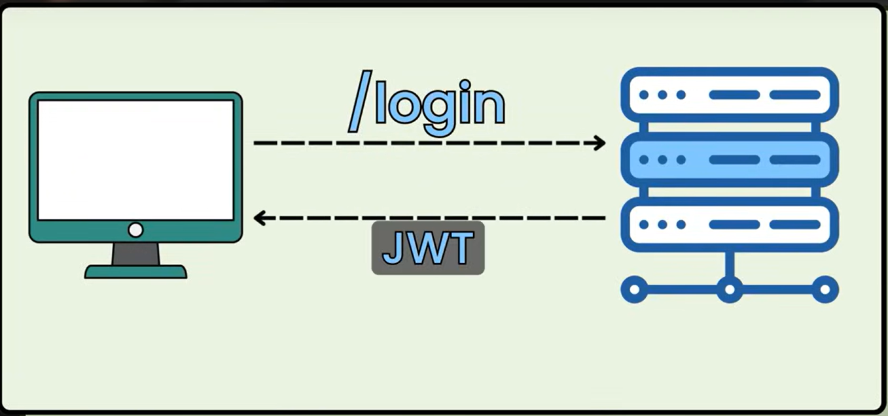

# Spring Security Notes
Cross-Site Request Forgery: A malicious site getting access to user session id and accessing user's site.

Creating @Bean will tell spring to use this config instead of default one.

## Authentication Provider:
When you fill username and password in a form and send it, it is a un-authenticated Authentication Object(Authentication is an interface extends Principal), which will be validated by AuthenticationProvider and authenticated.
Once authenticated, Spring Security stores the user in SecurityContext.
Spring Security expects user to be stored in a special way, i.e. UserDetailsService.
It uses UserDetailsService to verify.

## Principal:
The currently logged in user.

## UserDetailsService:
This is used by spring automatically to verify username and password.

## Custom AuthenticationProvider:
@Bean
AuthenticationProvider authenticationProvider()
    DaoAuthenticationProvider -> @Deprecated
        setPasswordEncoder()
        setUserDetailsService(UserDetailsService) -> @Deprecated

MyUserDetailsService implements UserDetailsService
    UserDetails - loadUserByUsername(String username)

UserPrincipal implements UserDetails
    String - getPassword()
    String - getUsername()

## AuthenticationManager:
AuthenticationManager will talk to AuthenticationProvider.
AuthenticationManager is an interface, and AuthenticationConfiguration is a class which provides AuthenticationManager object by calling getAuthenticationManager().

### AuthenticationManager uses the @Bean UserDetailsService by default:
If you have a @Bean of type AuthenticationManager and a @Bean called UserDetailsService, @Bean of type PasscodeEncoder.
Then spring automatically wires it.

## JWT:
Components:
WebToken - Unique id for each user
Header - Encoding Algo or something
Payload - Specfic user data like username, password
SigningKey - Key used by Developers

Before: XML -> huge data even after being encoded.
so JSON -> smaller when you encode.

### Claim:
Data on the JSON is Claim. Eg: Name, Issue time(iat) and Expiry time(exp).
Name, Issue and Expiry time is in the payload.
Header as algorithm(HS256 - Hmac Sha) and type(JWT).
Signature is like a stamp to verify if the card(Token) is valid.

Anyone can see the token, but they will be identified as fake, if the fake token is validated by Signature.

The main use of JWT is not secrecy, its accountability.

JWT Steps:



### Secret Key:
Should be a Key type compatible with Hmac Sha (256 bits).

Key Generator is a class from Crypto package can be used to create a key.

### Custom Filter Chain:
If you dont include .formLogin(), UsernamePasswordAuthenticationFilter wont be added. But if you do add JwtAuthenticationFilter before it, it will position jwt filter in a position before wherever UsernamePasswordAuthenticationFilter would have been in the filter. This works because they are marked with @Order.

### How JWT Filter Chain work when user is accessing unprotected page like login / register?
JWT Filter has a condition to check if request has authorization header (which usually has jwt token). If none found, request will be passed on. When it reaches .authorizeHttpRequests() and sees that login / register is allowed, it will pass on.

If user tries to access protected page with no authorization header, JWT filter will pass on, but .authorizeHttpRequests will stop it because there is no authentication object in SecurityContextHolder.

If it goes throught JWT Filter, it will have added username and credentials in SecurityContextHolder, so proceeding filters can check it as well.

### OncePerRequestFilter:
Its an abstract class which we can use to make Jwt Filter.
Its named that because, filter runs once per request.

### SecurityConfig:
To control access based on type of requests.
```
.requestMatchers(HttpMethod.POST, "/api/secure").authenticated() (or) .denyAll()
```

.formLogin() by default expects a GET request to show the login page and POST request to send the username and password.
.loginPage() -> GET
.loginProcessingPage() -> POST
If you delete .formLogin()'s .loginPage(), you will lose feature to redirect users to Login page when they access protected pages.

When using session, you use .formLogin().
When using JWT, you dont use it (Handle redirection in frontend).

.formLogin() and things like HttpSession automatically creates session id.
To disable session:
```
.sessionManagement(session -> session
                        .sessionCreationPolicy(SessionCreationPolicy.STATELESS))
```

### JWTService:
```
String jwt =  Jwts.builder()
                .claims()
                    .add(claims)
                    .issuer("Humans")
                    .subject(username)
                    .issuedAt(new Date(System.currentTimeMillis()))
                    .expiration(new Date(System.currentTimeMillis() + 60 * 60 * 5))
                .and()
                .signWith()
                .compact();
```

### JWT Filter:
Used to verify users JWT token each time they send a request.
Achieved by adding a filter before the UsernamePasswordAuthenticationFilter

### Dependencies:
MVN repo: JJW, JJWT Implementation, JJWT Jackson (Needed when you use .claims(): To convert claims map into JSON)

## Why use DTO?
To prevent mass assignment, where more fields than what is requested is sent in the request.

## FitlerChain:
.formLogin()
    .defaultSuccessUrl(String defaultSuccessUrl, boolean alwaysUse) -> when user accesses protected page, it will redirect to login(after login, he will be redirected to the protected page he tried to access before it alwaysUse is false or not given)
.permitAll() in any filter, will allow even unauthenticated users to access the page.

## Session Management:
Spring automatically creates and stores session in client cookie storage when user logs in. Postman it might not work even if it got session id back.

## DaoAuthenticationProvider:
The DaoAuthenticationProvider is a core component of Spring Security used for authenticating users based on their username and password. It implements the AuthenticationProvider interface and relies on a UserDetailsService to fetch user details and a PasswordEncoder to validate the provided password.

## interface:
HttpServletRequest
    HttpSession - getSession()
HttpSession
    String - getId()
    Object - getAttribute()
Csrftoken
SecurityFilterChain
Customizer - FI
    customize(T)
    Customizer - withDefaults() - static
UserDetails
AuthenticationProvider
AuthenticationManager - FI
    authenticate(Authentication)

## class:
HttpSecurity
    csrf(Customizer)
InMemoryUserDetailsManager
    createUser(UserDetails)
DaoAuthenticationProvider -> @Deprecated
    setPasswordEncoder()
    setUserDetailsService()
SecurityContextHolder
    getContext()
BCryptPasswordEncoder -> constructor takes strength (Can create object yourself or add it as a Bean)
    encode()
UsernamePasswordAuthenticationToken -> returns

CsrfConfigurer
AbstractHttpConfigurer
AbstractRequestMatcherRegistry
AuthorizeHttpRequestsConfigurer
AuthenticationConfiguration