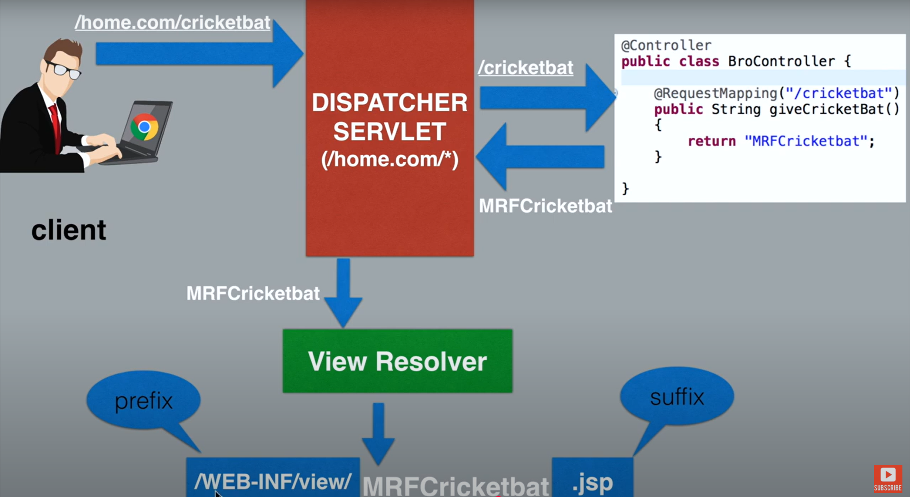

# Spring Notes
https://www.baeldung.com/spring-tutorial

form action --> to different page registration (/registration)
onclick --> calls js functions

### IoC:
Transfer control of objects to framework.
Advantage: decoupling the execution of a task from its implementation.

### DI:
Pattern to implement IoC. Injecting objects into other objects, is done by an assembler rather than by the objects themselves.

Traditional Code:
```
public class Store {
    private Item item;
 
    public Store() {
        item = new ItemImpl1();    
    }
}
```
Using DI:
```
public class Store {
    private Item item;
    public Store(Item item) {
        this.item = item;
    }
}
```

#### Types:
Constructor based
Setter based
Field based (with @Autowired)

### Runtime Polymorphism:
Vehicle vehicle = new Car() --> provides loose coupling. Can do Vehicle vehicle = new Truck() --> new implementation.
Car vehicle = new Car() --> tightly coupled to Car class.

### ApplicationContext:
https://www.baeldung.com/spring-application-context

Interfaces BeanFactory and ApplicationContext represent the Spring IoC container.
BeanFactory: root interface with basic func.
ApplicationContext: sub interface with all func.

It is responsible for instantiating, configuring and assembling objects known as beans, as well as managing their life cycles.

Implementations of ApplicationContext interface:
1) AnnotationConfigApplicationContext, ClassPathXmlApplicationContext and FileSystemXmlApplicationContext for standalone applications.
2) WebApplicationContext for web applications.

Container uses config metadata as xml or java class.
```
ApplicationContext context = new ClassPathXmlApplicationContext("applicationContext.xml");
```

### AnnotationConfigApplicationContext, AnnotationConfigWebApplicationContext:
Used with java metadata.

### XmlWebApplicationContext, FileSystemXMLApplicationContext, ClassPathXmlApplicationContext:
Used with xml metadata.
1. If metadata is in web.
2. If metadata is in file system.
3. If metadata is in class path. In classes folder of web application.

### Bean:
A bean is an object that the Spring container instantiates, assembles, and manages.

Ways to configure beans:
#### Java based:
```
@Configuration
public class AccountConfig {

  @Bean
  public AccountService accountService() {
    return new AccountService(accountRepository());
  }

  @Bean
  public AccountRepository accountRepository() {
    return new AccountRepository();
  }
}
```

#### Annotation based:
@Component, @Controller, @Service, @Repository, @Autowired, and @Qualifier.
In xml, annotation-config tag enables annotation-based mappings.

#### XML based:
bean mappings is done in the XML configuration file.

### 
#### @Configuration:
Contain bean definition methods annotated with @Bean.

#### @Component:
Spring managed singleton bean created using annotation.

#### @Bean:
A method to define a bean. Default bean name is method name.

##### Bean scope:
@Scope("singleton") same instance.
@Scope("prototype") diff instances.

##### Lazy Initialized Beans:
```
<bean id="item1" class="org.baeldung.store.ItemImpl1" lazy-init="true" />
```
(or)
@Lazy

To prevent bean creation during initialization. Bean created only when requested.

#### @Autowired:
Annotation for autowiring by type.
Annotations-driven Dependency Injection.
If another class needs a bean(object which is in IoC container), autowired brings it here.

##### @Qualifier("{bean_name}"):
Reference bean by name if there is more than one bean of the same type.

#### @ComponentScan(basePackages = "com.baeldung.annotations"):
During the component scan, Spring Framework automatically detects classes annotated with @Component.

#### @Repository:
Repository classes usually represent the database access layer in an application, and should be annotated with @Repository

#### @Service:
Business logic of an application.

#### @Controller:
Controller in MVC.

#### @SpringBootApplication:
This single annotation is equivalent to using @Configuration, @EnableAutoConfiguration, and @ComponentScan.
When we run this Spring Boot application, it will automatically scan the components in the current package and its sub-packages.

## Lifecycle:
https://www.baeldung.com/spring-autowire

1) Component Scan is done via @SpringBootApplication or @ComponentScan.
2) Classes annotated with @Component and @Beans in config classes are registered to Application context.
3) After registering all beans, objects is created for all beans.
Constructors of @Components classes are called to create class objects.
If the @Component class has other class objects as arguments, @Autowired provides those objects if they are in Spring container, else it throws error "No qualifying bean was found". *
If @Bean is set as @Lazy, then object creation is done during getBean().
If @Bean scope is prototype, then only bean metadata is stored in Application Context, no object.

*You can do @Autowired(required=false)

public api frontend with js, html, css.
no fancy ui, just functionalities.
banking, medical etc.

## Lombok:
An extension where if u annotate class with @Data, it will automatically add getter, setter etc.

## In java config:
```
@Bean(name = "m1")
public Class method() {
  return new Class();
}
```
ApplicationContext context = new AnnotationConfigApplicationContext(Config.class);
Student stObj = (Student) context.getBean("m1");
(or) getBean(Class.class) --> when name not given and only one method avail.
(or) (Student) getBean("method") --> when name not given.

## Annotation:
Cant use @Configuration at method level.
Because its defined in @Retension etc.

All methods with @Value will be executed even if method not called.

If you mark a method(not variable) with @Required, it will make sure the value of method parameter is not null before u use the bean.

## Converter interface:
All values in property file is stored as String.
@Value sends String values from property files to bean values, but if target value is given as other types, it tries to convert String to the target type using Converter Interface.
We can implement Converter and @Override the convert(source type, target type) method to tell @Value to perform custom conversion.

## AOP:
@Before, @After, @Around
@After - execute Aspect method before control returns to Main class.
@AfterReturning - execute Aspect method after control returns to Main class.
@AfterThrowing - execute Aspect method after any method or all methods from class throws exception.

@AfterReturning("execution()")

### execution format:
* {className}.*(..)
* --> return type
{className} --> name of class
* -> method name
Asterik(*) means select all methods (or) all return types.

@AfterThrowing(pointcut="execution(* EasyBank.*(..))", throwing="exception") --> throwing is just for doing exception.getMessage()

### apply for 2 or more methods:
@Around("execution(void EasyBank.doWithdraw(int amount)) || execution(void EasyBank.doDeposit(int amount))")

## What are these?
@RequestMapping? - POST & GET
SpringExpressionLanguage - "${home.location}"
GetMapping("\", "\spring")?
CORS?
Maven Wrapped (mvnw)
@PostConstruct

## @Entity
@Table(name="car")

## Relationships:
https://www.youtube.com/watch?v=VLlDaIcb3jE

If you add relationship annotation, it creates sub tables with the relationships, like student_laptop. To prevent this, we can do mapped by inside @ManyToOne().

When using @OneToMany, you cant store a list of laptops in student. so student_laptop table is created.

When using @ManyToOne, you can store the student PK as a column in laptop table.

Since, student table's PK is already mapped to laptop table, you can prevent it from creating student_laptop talbe by mentioning @OneToMany(mappedBy="user");

@OneToOne adds a column with PK in one table.

## @Controller, View Resolver:
```
@ResponseBody
@RequestMapping("/cricketbat")
public String giveCricketBat() {
  return "returning cricket bat";
}
```
This returns the String. Without @ResponseBody, it checks for the file called returning cricket bat. Here you can give "/WEB-INF/view/returnCricketBat.jsp" --> this is a view file.

WEB-INF: views inside it cannot be viewed and modified by bad actors.

Client: /home.come/cricketbat -> Dispatcher Servlet: /home.com/* -> Controller: return "MRFCricketBat" (this is the base name, a view file) --> Dispatcher Servlet (To help Dispatcher understand what is MRFCricketBat, we use View Resolver) --> Client



View Resolver adds the prefix and suffix to base name.
prefix: /WEB-INF/view/
suffix: .jsp

We use InternalResourceViewResolver extends UrlBasedViewResolver --> which has prefix and suffix variables.

The ViewResolver is responsible for:

Mapping logical view names (like "showPage") returned by controllers
To actual JSP files (like /WEB-INF/views/showPage.jsp)

## Cyclic Redundancy:
When Bean A depends on Bean B and
Bean B depends on Bean A.
The dependent class must be a @Bean for spring to inject dependencies into it.
If its not a @Bean, spring wont be able to inject dependencies into it.

## @ModelAttribute, ModelMap:
Model: A container for data, that you send to the view. Its a temporary data store to send from controller to view. *Not to be confused with MVC Model @Entity.

ModelMap: its like a Hashmap (a container), to store data to a name and use it in jsp. ModelMap creates a model with a name to be used in jsp.
```
@PostMapping("")
public String messageMethod(ModelMap map) {
  map.addAttribute("message", "Welcome World");
  return "home";
}
```

### Method level @ModelAttribute
This will be called before every other RequestMapping and will be called for each RequestMapping.
```
@ModelAttribute("register")
public List<String> options() {
  List<String> list = new ArrayList<>(Arrays.asList("cat", "dog", "elephant"));
  return list;
}
```

### Parameter level @ModelAttribute
```
public String sportsRegistration(@ModelAttribute("registration") Registration registration) {

}
```
This puts the form values to Registration object and also creates a ModelMap with registration as name, to be used in jsp.

## Properites file:
@PropertyScan("goldRateDetails.properties") --> in @Configuration
@Value("#{${gold.rate}}") --> since gold.rate is a map

Advanced Java
SQL
Angular 30% (concepts alone)
SpringBoot @RestController
Functional Testing
JIRA
Agile