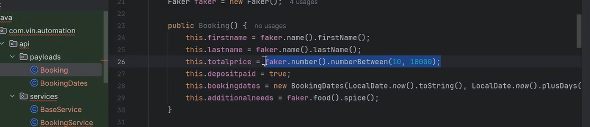
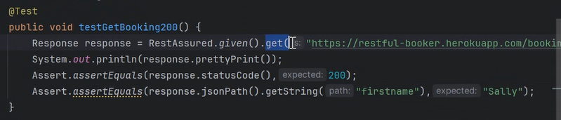
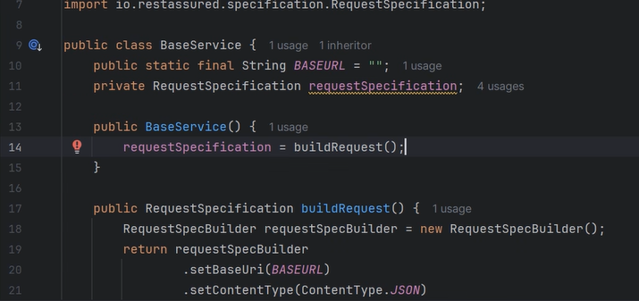
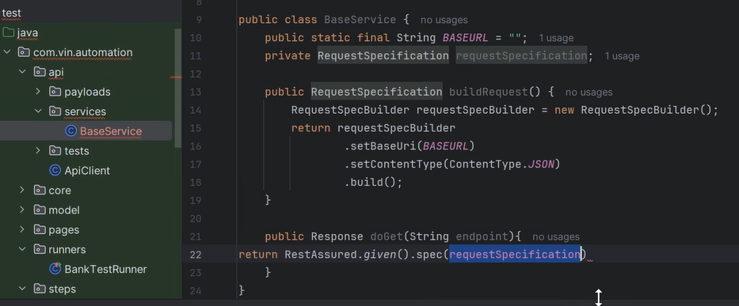
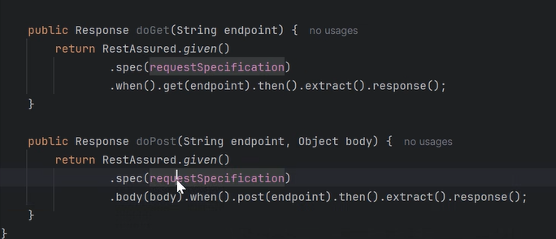
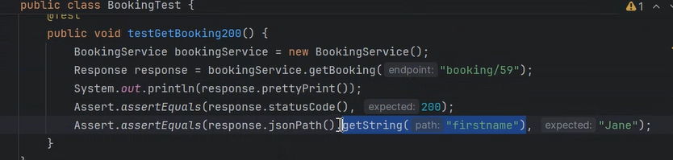
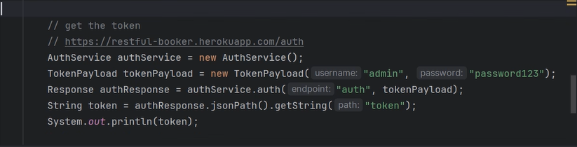
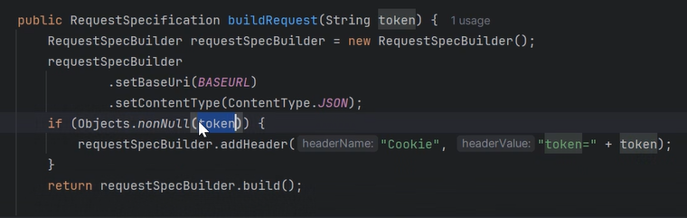
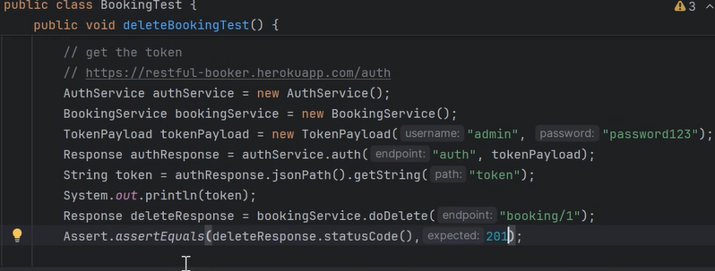

# API Testing:
Rest, Soap, GraphQL

## For SOAP API:
WSDL document (xml) : contract with client
    based on this doc, we can see what are all the APIs present.

## For REST API:
To Learn:
    Where we use Get, Post..
    Curl

## Rest Assured:
MVN dependency: rest-assured, jackson (map JSON to POJO classes), javafaker (provides fake data).

### javafaker: 






RequestSpecBuilder -> to build request.


Main:


Auth:

Getting token from site by sending post with username and password.
Use that token in header when sending other requests.



## RequestSpecBuilder:
It is part of rest assured, used to make reusable request configuration.
```
RestAssured
    .given(requestSpecification)
    .body(object)
    .when() -> syntax sugar
    .post(endpoint)
    .then() -> gives a validatable response. eg. then().statusCode(200).body("name", equalTo("John Doe")) : checks if response status code is 200 and name.
```
```
RestAssured
    .given()
    .baseUri("http://")
    .body()
    .when()
    .post(endpoint)
    .then()
    .statusCode(200)
    .extract()
    .response();
```

## Payload Object to JSON, Serialization:
When we make Payload Object like RegistrationData and use jackson to turn it into json, we need getters inside RegistrationData class to map variables to json keys.