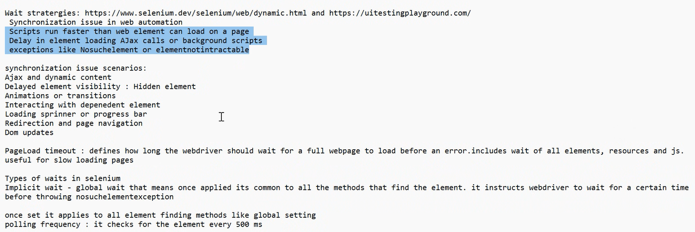
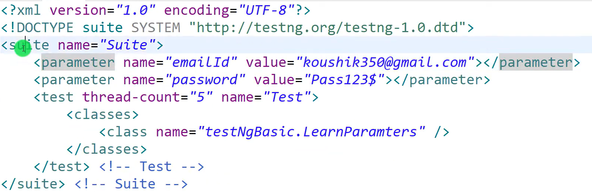
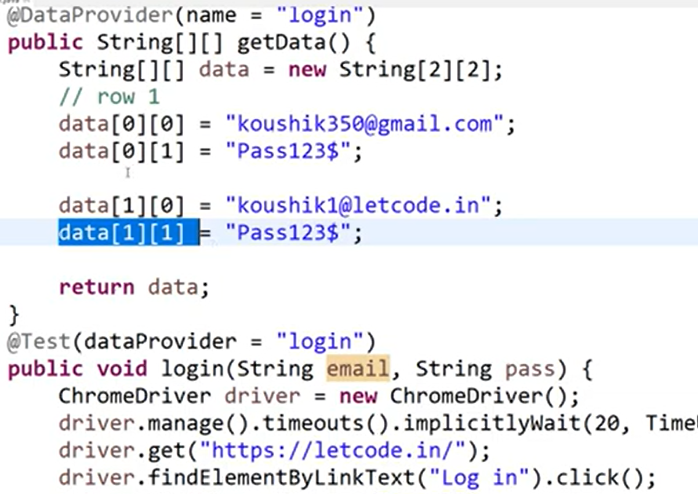

# Automation Testing Notes
By.id("") -> have to use doulbe quotes.

## Why AT?
Increased speed and efficiency.
improved accuracy and reliability.
broader test coverage.
cost and time savings.
enhanced quality.
24/7 test execution.
better use of resources.
regression testing efficiency.
support for CI/CD.
deeper testing capabilities.

## Selenium - Open Source:

Eventhough ChromeDriver implements both WebDriver and JavascriptExecutor interfaces. During compile time, java checks the reference type, which is WebDriver. 
```
WebDriver driver = new ChromeDriver();
```
Eg:
Animal a = new Dog();
Reference type: Animal
Object type: Dog
At compile time, Java only know a is an Animal, so it can use method under Animal. If Dog as a method called bark which is not declared in Animal, then it throws 'compile error! Animal doesnt have bark()'.

In compile time, Java makes a list of things a can use. It makes this list by looking at Animal.
If Dog as a method called bark, which is not declared in Animal, you can't do a.bark().
You have to typecase like:
Dog d = (Dog) a;

### Selenium Architecture.
A driver like JDBC driver.
To automate functional testing.
Test suite - will automatically run and test the product whenever there is a release. (Smoke test as a suite)
If 90% of test cases pass, they can release the build.
Can be used to automate things, like submit timesheet.
Multiple programming lang.
4 components: 
Idle
Webdriver
Grid (Distributed execution) Eg. running test cases parallely instead of running test cases one by one.

## Webdriver - Interface:
There is a driver for each browser.
ChromeDriver will have chrome packages.
WebDriver driver = new ChromeDriver();
driver.get("localhost")
sout > driver.getTitle()
driver.manage().timeouts().implicitlyWait(Duration.ofSeconds(5))

## Locators: to select each element in a web page.
There are 7-8 locators.
By.id() -> this is a locator
Static and Dynamic selectors / Attribute and Property selectors.
findElements() -> select elements.
WebElement fullName = driver.findElement(By.cssSelector("#fullName")) -> full name is the id. (or) By.id("email")

WebElement submit = driver.findElement(By.cssSelector("input[type='submit']"))

fullName.sendKeys("Adam")
reg-no.sendKeys("2")
submit.click()

driver.quit() -> browser will close

### 0th Commands:
System.setProperty(key, value) -> for manually setting driver jar.
driver.get()

#### Navigate:
driver.navigate().back()
driver.navigate().forward()
driver.navigate().refresh()
driver.navigate().to()

#### Screenshot File:
```
File file = new File("./image.png");
File screenshot = ((TakesScreenshot) driver).getScreenshotAs(OutputType.FILE);
FileHandler.copy(screenshot, file);
```

### WindowHandler:
String - driver.windowHandle()

### 1st Commands:
findElement(By.id())
By.name()
By.tagName()
By.className()
By.cssSelector()
By.tagName()
By.linkText()
By.partialLinkText()

### 2nd Commands:
(By.className()).getAttribute() -> html attribute's value
(By.className()).getCssValue() -> css attribute's value
Rectangle - (By.className()).getRect()
(By.className()).clear() -> clears written text
(By.className()).getTagName()
(By.className()).getText()

#### Location:
Dimension - (By.className()).getSize() -> can print dimension: (width, height)
dimension.getHeight()
dimension.getWidth()
Point - (By.className()).getLocation()
point.getX()
point.getY()

Store all values in select tags.
optionsList = driver.findElements(By.tagName("select"));

https://www.guru99.com/execute-javascript-selenium-webdriver.html

## selecting radio button:
radioButton.click();

## Select Element:
WebElement dropdown = driver.findElement(By.id("dropdownId"));
Select select = new Select(dropdown);
select.selectByVisibleText("Option Text");
select.selectByValue("optionValue");
select.selectByIndex(2);

## Alert:
```
Alert alert = driver.switchTo().alert(); -> alert returns Alert
alert.accept();
alert.dismiss();
alert.getText();
alert.sendKeys();
```

## Actions Class (Left Click, Right Click, Drag & Drop, Offset):
Action - interface
Actions - class
```
Actions actions = new Actions(driver);
actions.contextClick(btnElement).perform(); -> left click
actions.doubleClick(btnElement).perform(); -> double click
builder.dragAndDrop(from, to).perform(); -> from and to are WebElement

Action action = actions.dragAndDrop(from, to).build();
        action.perform();

builder.dragAndDropBy(from, xOffset,yOffset).perform();
```
https://www.toolsqa.com/selenium-webdriver/drag-and-drop-in-selenium/

```
actions.click(dateInput).sendKeys(formattedDate).perform();
```

### moveToElement:
actions.moveToElement(element)
       .clickAndHold()
       .moveByOffset(20, 0) // Move slider by 20 pixels on x-axis
       .release()
       .build()
       .perform();

## getText():
WebElement f=driver.findElement(By.id("result"));
String f1=f.getText();

## Select class:
You can't select select/send tag with Standard locators. You need to use Select class.
(most used) ByVisibleText
ByValue
(least used) ByIndex

## JavaScriptExecuter:
Used to select/send date.

WebElement traveldate = driver.findElement(By.id("traveldate"));
JavascriptExecutor js = (JavascriptExecutor) driver;
js.executeScript("arguments[0].value='19-09-2023'", traveldate);

If you want to enter value in JavascriptExecutor, you send it using arguments[]:
```
WebElement emailElem = driver.findElement(By.xpath("//input[@id='email']"));
exec.executeScript("arguments[0].value=arguments[1]", emailElem, "george@gmail.com");
```

## To implement two quotations:
exec.executeScript("document.querySelector(\"input[type='submit']\").click()");

## Testing Engine - in MVN Repository:
Advantages of using TestEngine over JUnit.

## Annotation:
@Test - to define a specific test case.
@BeforeTest - initialize WebDriver (void init()).
@AfterTest - (void tearDown()). Works like finally, driver.quit().

## Selenium Exceptions (Important for Exam):
Know what each exception do.
WebDriverException -> parent of all exception (Base exception).

Kinds of exception under WebDriverException:
InvalidElementStateException
ElementNotInteracableException
NotFoudnException
SessionNotCreatedException

NoSuchElementException -> when wrong element id is given and selenium is unable to find it.
TimeOutException - if time runs out

## Dynamic Locator:
When you dont have any id attribute for an element, we can use XPath.

Filter in inspect:
//input[@list='my-options'] - XPath Locator
input[list='my-options'] - Css Locator

xpath(relative & absolute)
absolute xpath: starts from html.
css(id, class, attribute, inner text)

## Maximize window:
driver.manage().window().maximize();

## Wait Strategies:


Selenium checks the currently displayed DOM, if DOM elements change (like ad banner which changes in flipkart base don time). then selenium wont be able to identify the element.

The default page load timeout in selenium webdriver is 300 seconds. If page doesnt get load in this time, it will throw TimeoutException.

```
Thread.sleep(1000) -> Not related to selenium (don't use)
```

### Implicit Wait:
Global wait: Once applied, its common to all findElement methods. It instructs webdriver.
It will wait 10 secs for each element if its not found.
Implicit will wait only if Element is Not Found, otherwise it won't wait.
Polling frequence: 500ms.


```
driver.manage().timeouts().implicitlyWait(Duration.ofSeconds(10));
driver.manage().timeouts().implicitlyWait(Duration.ofSeconds(20));
```
Here, 20 seconds will overwrite 10 seconds.

Synchronization Issue: When script is faster than page loading.

### Explcit Wait:
Flexible, targeted and is applied to specific element or action.
Instructs the webdriver to wait for a certain contdition to be met.
Checks various conditions like visibility, clickability, text presence etc.
Polling frequenece: 500ms.
Within the 10 seconds, every 500ms it will poll, whether the condition is satisfied. If the condition is satisfied, it will stop the wait or else throw TimeoutException.

```
WebDriverWait wait = new WebDriverWait(driver, Duration.ofSeconds(10));
wait.until(ExpectedConditions.elementToBeClickable(targetInput))

wait.until(ExpectedConditions.visibilityOf(billShow));

WebElement billShow = wait.until(ExpectedConditions.visibilityOfElementLocated(By.id("billShow")));
```

### Fluent Wait:
More customizalbe version of explicit wait.
Allows you to define polling intervals and timeouts.
Can ignore specific 

```
Wait fluentWait = new FluentWait<WebDriver> (driver). withTimeout(Duration.ofSeconds(10)).pollingEvery(Duration.ofSeconds(4)).ignoring(Exception.class);
```
Eg. element is enabled after 5 seconds.
0th sec -> element not enabled
4th sec -> element not enabled
8th sec -> element enabled
Waits for 8 seconds. But explcit wait will wait for less seconds than fluent wait, because it polls every 500ms.

## TestNG:
Its like a execution framework.
Has annotations like @Test, @BeforeTest, @AfterTest;
@Test can be used in class level -> test suite(group of test cases)


### Order of Execution:
@BeforeSuite -> called only once (can be many classes)
@BeforeTest
@BeforeClass
@BeforeMethod
@Test

## XPath:

### Types:
Absolute : /html/body/tag
Relative : //tag

Eg:
//button[ng-click='customer()']

// - relative locator (start from button)
button - element type
@ - for attributes

Eg: (going from parent to child)
//div[@class='center']/button

div - parent
button - child

### XPath patterns:
Attribute XPath
Conditional XPath
Collections
XPath functions
Text based
Ancestor, Parent
Axes
XPath wildcard
SVG

Don't write XPath with attributes which change (dynamic).

### Attribute based:
#### and (or) or:
//input[@type='text' and @name='name']
    //input[@type='text'][@name='name']
//input[@type='text' or @name='name']

### Collection based: (not recom)
(//input[@type='text'])[1] -> index starts with 1

### Functions:
//input[contains(@placeholder, 'Ente')] -> partial text pattern match
(//input)[last()]
(//input)[last() - 1]
(//input)[position() = 1] (or) > 1(takes to 2nd elem)

### Text based:
//label[text() = 'Enter your full Name'] (or) //label[. = 'Enter your full Name']
    //label[contains(text(), 'Enter your full')]
//label[starts-with(text(), 'Enter')]
//button[normalize-space() = 'Refer the video'] -> Trim the space in front end end of text in the element like ' Refer the video '.

### Parent, Child, Ancestor(parent's parent):
#### Child to Parent:
```
<div>
<a><strong>Sign Up</strong></a>
</div>
```
//strong[.='Sign Up']/parent::a (or)
    //strong[.='Sign Up']/parent::a[@class='parent-class'] (or Shortcut)
    //strong[.='Sign Up']/..

#### Parent to Child:
//div[@class='navbar-item']/div/a (or Shortcut)
    //div[@class='navbar-item']//a

#### Ancestor:
```
<div> -> ancestor
    <div></div>
    <div></div>
    <div></div>
    <button>Login</button>
</div>
```
//button[.='Login']/ancestor::div

#### // select multiple elements:
//table[@id='timetable']/child::tbody/child::tr[2]//td
Here //td -> will find all elementes anywhere below the current node.

#### Axes:

following, following-sibling
preceding, preceding-sibling
```
<div>
    <div></div>
    <div></div>
    <button>Login</button>
    <div></div> -> following-sibling
</div>
```
//button[.='Login']/following-sibling::div
(preceding-sibling is the inverse of this)
Whenever we use preceding, keep in mind that, if there are more than 1 preceding elements, it will always select the first one. (can use indexing or @ to select accurately).

for preceding, [position() = 1] will select element just top of base element.

following and preceding will select all following and preceding elements.

#### Wildcard:
//* -> all elements in the dom
//*[@id='user_name']
//input[@*='Enter the first and last name']

#### SVG (Scalar Vector Graphics):
//*[local-name()='svg'][@class='global-nav_logo']
local-name is like input type but can be used for any name in the html.

## Test Validation Assertion:
Always user Assert in interviews.

Soft Assert - not recommended mostly because it might waste time (All assert is validated)
Hard Assert - by default (If first assert fails, program ends)

assertTrue(str.isEmpty())
softAssert.assertAll()

Assert.assertEquals(actualAccountNumber, expectedAccountNumber) -> we perform validation here and raise defect id

assertTrue()
assertFalse()
assertEquals(s.generatePassword(), "146EEEEml");
assertNull()
assertSame(ins.size(), 3);

## Report:
Html page

## Listener (Retry):
@Listener

## Interview Questiobs:
CSS cant go backward, XPath can traverse any direction.
Browsers before didnt have option to find by XPath in inspect, so it was claimed CSS was faster than XPath.

aria- attributes are for screen readers. 

So, we can use them to locate elements.
Can add attributes to html elements to locate it like data-test=''

## Apache POI:
Mvn dependencies - Apache POI Common, Apache POI API Based on OPC and OOXML Schemas.

If you want to read or write data in Excel, follow this hierarchy: (Components)
Excel file -> Workbook -> Sheets -> Rows -> Cells
To interact with these components, there are separate classes.
Keep excel file in a folder called testdata.

### Excel file:
FileInputStream - reading
FileOutputStream - writing

### Other components:
XSSFWorkbook -> workbook
XSSFSheet -> sheet
XSSFRow -> row
XSSFCell -> cell

```
FileInputStream file = new FileInputStream(""); -> throws FileNotFoundException
System.getProperty("user.dir")+"\\test\\data.xlsx" -> System.getProperty will return address of current project
XSSFWorkbook workbook = new XSSFWorkbook(file);
XSSFSheet sheet = workbook.getSheet("Sheet1"); (or) workbook.getSheetAt(0);

int totalRows = sheet.getLastRowNum() -> returns last row number(starts from 0 and returns value)
int totalCells = sheet.getRow(1).getLastCellNum(); -> gets last cell number(starts from 0 but returns last value+1)

XSSFRow currentRow = sheet.getRow(1) -> gets entire first row
XSSFCell cell = currentRow.getCell(1); -> getCell() is 0 based.
cell.toString();

workbook.close();
file.close();
```
*Excel will start from 1, Java will start from 0

### Type from excel to Java:
Excel interprets values like 1234567890 as a number, and Apache POI reads it as a double, which gets converted to scientific notation (1.23456789E9) when calling toString().

So use:
```
DataFormatter formatter = new DataFormatter();
Reservation.customerData[0] = formatter.formatCellValue(row.getCell(0)); -> can also add .trim to the end.
```

### Create excel file and add data:
```
FileOutputStream file = new FileOutputStream("");
XSSFWorkbook workbook = new XSSFWorkbook();
XSSFSheet sheet = workbook.createSheet("Data");
XSSFRow row1 = sheet.createRow(0);
row1.createCell(0).setCellValue("Welcome");
row1.createCell(1).setCellValue(1234);

workbook.write(file);
workbook.close();
file.close();
```

## Page Object Model:
```
By userName = By.name("username");
```
Here, for each element that accesses the userName, it will use a separate thread, which can cause overload. so you private static final (make username to USERNAME, convention to show that it is final)


## Selenium 4:
Relative Locators:
above();
below();
toLeftOf();
toRightOf();

## Headless and Headfull:
Headless: Browser doesnt open, it runs in background as console app.

## TestNG:
@Test
public void test1() {}

### Convert to TestNG:
Will create a xml file with testNG config. Xml will have the thread-count, name, classes. Can add groups.
TestNG Suite: collection of test cases(xml file is used run the test suite).

thread-count -> if its 2 and there are 4 @Test, then it will first run 2 @Test.
If one @Test finishes, 3rd @Test will start running.

Bunch of @Test runs based on ASCII of name.
@Test(priority = -1) has more priority than @Test(priority = 0)

@Test(dependsOnMethods = "test1") (or) (dependsOnMethods = {"test1", "test2" })
dependsOnMethods take precedence over priority
(or) @Test(dependsOnMethods = "{package}.{class}.{method}")

Result show how many test cases:
Run
Passed
Failed -> didnt complete entire execution(maybe threw exceptions)
Skipped -> If test2 depends on test1, but test1 fails. So, test2 is skipped.

@Test(invocationCount = 3) -> This @Test runs thrice. In result it will show 3 test cases run.
@Test(invocationCount = 3, invocationTimeout = 10000) -> invocationTimeout takes long value(in millis). If @Test case doesnt execute thrice within 10seconds, those test cases which couldnt run will fail.
invocationTimeout will work only if invocationCount is there.

@Test(dependsOnMethods = "test1", alwaysRun = true) -> Even if @Test depends on test1, it wil still run because of alwaysRun = true(by default alwaysRun = false)
@Test(enabled = false, alwaysRun = true) -> @Test wont run. enabled takes precedence over alwaysRun.

@Test(invocationCount = 3, threadPoolSize = 2) -> 2 browsers will run parallely. Can be used along with invocationCount only(otherwise it will run only once).

@Test(timeOut = 10000) -> Used maybe to check if a site gets data within a specific time(if it doesnt, there might be some backend problem).

### expectedExceptions
@Test(expectedExceptions = {NoSuchElementException.class}) -> Even if @Test fails, it will still run and complete. In result, it will no failures. Used when we already know that an exception will rise. {} means it accepts array, so we can add more exceptions.

### Groups:
@Test(groups = {"smoke"}) -> Can add groups tag in xml to run only test cases within this group.

exclude takes precedence to include.

### Parameters:
If you add parameters in login method and run this particular class, it wont be able to find the parameters. So, it should be run from xml file.

@Parameters({"emailId", "password"}) -> should have same name as in xml file.
@Test
void login(String email, String pass) {} -> should be same order as in @Parameters.


### Run two different browsers at same time:
Should get Browser driver from paramter in xml.
paramter tag inside suite tag is global.
paramter tag inside test tag is only for that test tag (Browser driver can be passed here).


### Parellel:
Can be given in test tag (test level) or in suite tag (suite level).
suite name="Suite" parallel="tests" -> targets test tags below suite tag.

test thread-count="5" parallel="classes" name="Test1" -> targets class tags below test tag.

### DataProvider:


@DataProvider should return 2 dimensional array.
public void login(String email, String pass) -> this is taken based on order from @DataProvider.
If @DataProvider is in a class and @Test dataprovider is in another class, then the @Test class can extend the @DataProvider class (or) you can do dataProviderClass = DataUtil.class.

@DataProvider(name="login", indices = {0}) -> will return only first excel row that is [0][0] and [0][1]. If you give row that is not there, it will give no tests case found. Can also give indices = {0, 1}.

If you want to run it in parallel:
@DataProvider(name="login", indices = {0, 1}, parallel=true).

But this works only if you initialize driver inside the @Test function.

@DataProvider(name="login") -> name is DataProvider's name.
@Test(dataProvider="login") -> login is DataProvider's name.
You can also do:
@DataProvider()
public void getLogin() {}
@Test(dataProvider="getLogin") -> use @DataProvider's method name.

If you use both @Parameters and @Test(dataProvider), dataProvider will take precedence. Only dataProvider parameters will be accepted.

Instead of,
@Test(dataProvider="getData")
public void login(String name, String id) {}
we can use,
public void login(String data[]) { sout(data[0]) }

### Heirarchy:
beforeSuite
beforeTest
beforeClass
beforeMethod -> for @Test 1
myTest -> for @Test 1
afterMethod -> for @Test 1
beforeMethod -> for @Test 2
myTest -> for @Test 2
afterMethod -> for @Test 2
afterClass
afterTest

afterSuite -> executed if all other before it is successful.

## POM:
@FindBy(id = "id")
private WebElement emailId;

public SetFormValues(WebDriver driver) {
    this.driver = driver;
    PageFactory.initElements(driver, this);
}
