# Cucumber Notes
TDD (Test-Driven Development) -> functional testing etc. (only technical people can understand)
BDD (Behavior-Driven Development) (anyone can understand feature file)

The core philosophy of BDD and Cucumber is that all scenarios should be independent and isolated. One scenario should not depend on the state left by another.

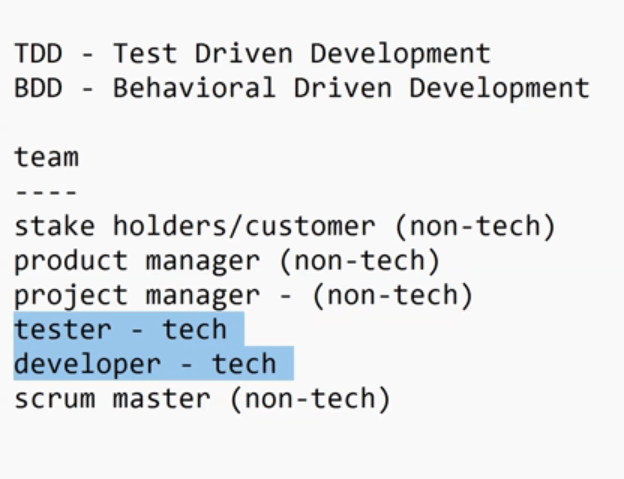

## Components:
1. Feature file (.feature)
2. Step definition file (.java)
3. TestRunner (.java)

We have scenarios in Feature file.
For each step in feature file, there will be corresponding method in Step Definition file(selenium methods).
TestRunner is a junit file. Cucumber internally folllws junit.

If scenario is not given properly in feature file and you implement methods in step definition, it will throw error.

## Listeners:
In Cucumber using TestNG runner, each scenario is considered a @Test.
So just create a class implementing ITestListener and override the methods.
Then add the @Listeners(TestListener.class) over the @CucumberOptions.

## Parallel:
Running TestRunners as parallel:
    If you have 2 TestRunner class, you can run both classes in parallel from testng.xml.
Running Scenarios in parallel:
    Inside TestRunner class:
        @Override
        @DataProvider(parallel = true)
        public Object[][] scenarios() { return super.scenarios(); }

scenarios method calls provideScenarios, which collects all feature files and scenarios discovered by Cucumber Engine with Cucumber Options and each scenario is made into an object array. We override it with parallel=true, to allow it to run multiple arrays.

Here, Cucumber internally uses TestNG's @DataProvider mechanism to feed each scenario as a test case.

For thread-count setting, Cucumber doesnt have its own settings for it, so it inherits TestNG settings, so you can mention it in testng.xml.
    or you can add this in TestRunner class:
        static { System.setProperty("dataproviderthreadcount", "3") }

### Development Workflow:
Feature File -> Step Definition File -> TestRunner.

### Execution Workflow:
TestRunner -> Feature File -> Step Definition file.

### Maven dependencies:
Junit
Cucumber Java, Cucumber JUnit 4
Selenium

## Feature file:
Test scenario which is in plain english.

Product owner might make the feature file and give it to QA and QA will check it and return to Product owner. When Product Owner is happy with the feature file, Automation Testers will make tests with the feature file.

There is a gap between what qa understands and what product owner understands. With BDD, we have a common feature file which both understands. Product Owner will know what are the things QA is testing. If PO wants, he can execute the tests and see. Brought transparency between PO, QA, even Devs.

Cucumber supports many languages, so it has Internationalization.

## Gherkin
Keywords to use inside feature file:
Feature, Scenario, Scenario Outline, Given, When, Then(positve outcome), But(negative outcome), And (Used to give another step after And)

Pre-condition - Given
Actions - When
Validations - Then

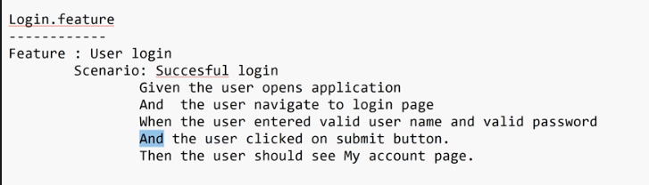
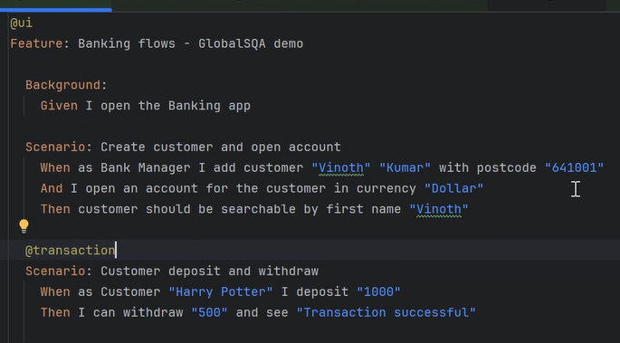
They are called Steps.

## Example Test:
### Feature File:
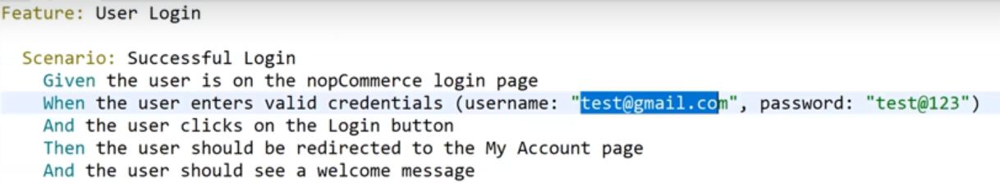

### Step Definition:
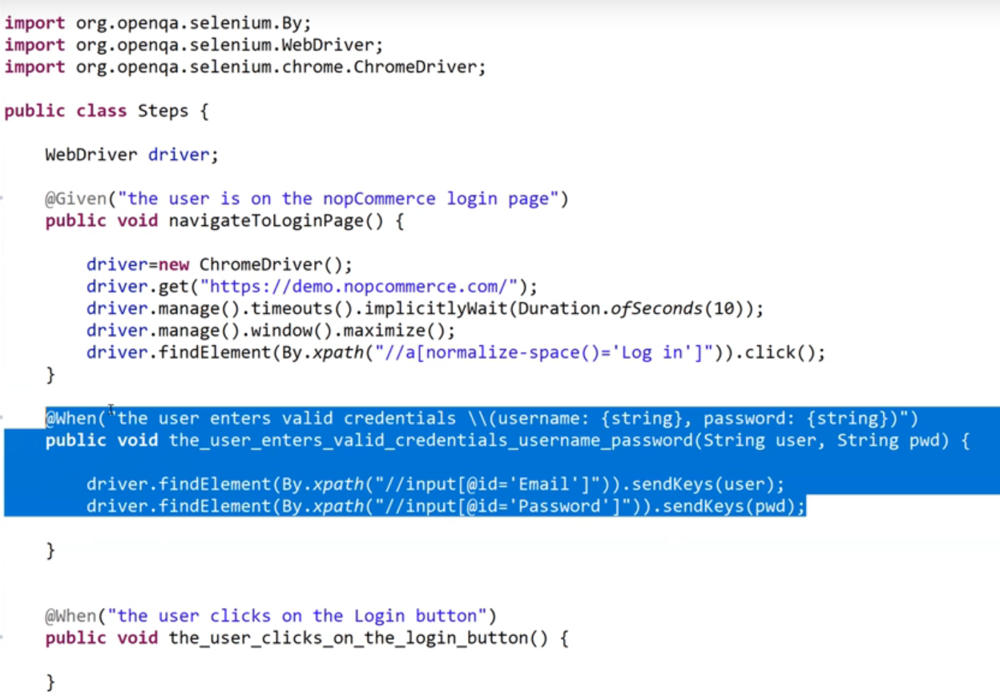
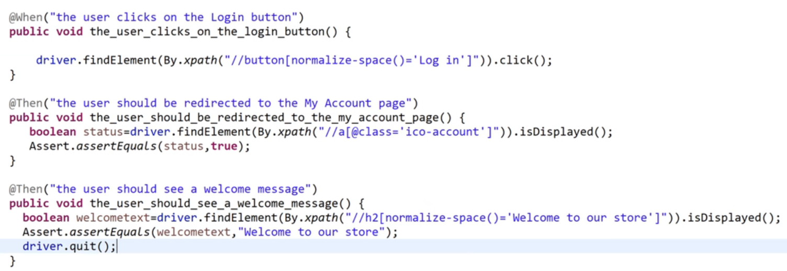
Just one step definition file is mostly enough. If we have 'login feature file' with steps like launch(), login(), validation(). For 'search feature file', you can just add search() step in same step definition file.

In last method in step def, dont give driver.quit(), it will prevent other scenarios from running.

If you throw cucumber.api.PendingException() in step def method(given in console template), it will show that this method failed. Without this, cucumber will show pass for this method even if you didnt give any code inside it.

### Test Runner:
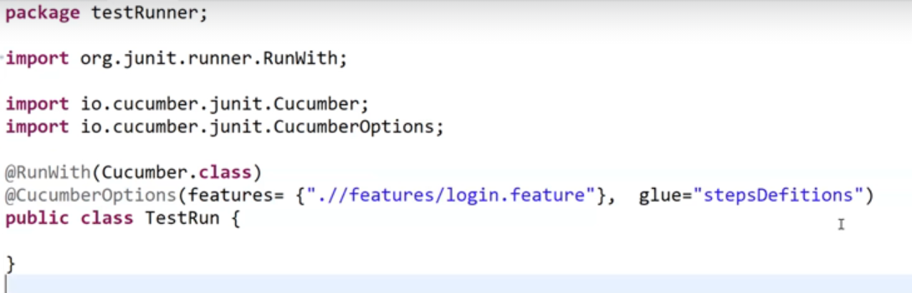
Cucumber.class and CucumberOptions is from Cucumber jUnit, not Cucumber java.
Both Cucumber.class and CucumberOptions are deprecated.

Junit 5:
https://medium.com/@koushicksudharsanam/junit-5-test-runner-configuration-with-cucumber-95e64863e66a

@CucumberOptions(
    features = {"src/test/java/features/login.feature"},
    
    dryRun = true, (doesnt execute, just checks for compilation errors like, if all steps have a step def method etc., by default it is false) (if any steps dont have step def method, it will give method template in console)

    glue = "steps" (step definition methods), cant tell it to use only one step class.
    
    snippets = SnippetType.CAMELCASE (bc cucumber was first dev in ruby, so method names are underscored by default)
    
    monochrome = true (removes the junk characters)
)
@RunWith(Cucumber.class) -> to tell Junit, instead of looking for @Test methods, use cucumber runner to execute feature files.

public class Runner extends AbstractTestNGCucumberTests {} -> AbstractTestNGCucumberTests class has information on how to run with @CucumberOptions

@RunWith(Cucumber.class):
    uses Cucumber with Junit runner.
    no support for parallel.
    Dependency: JUnit
extends AbstractTestNGCucumberTests
    uses Cucumber with TestNG runner.
    support for parallel.
    Dependency: TestNG

## Parameters:
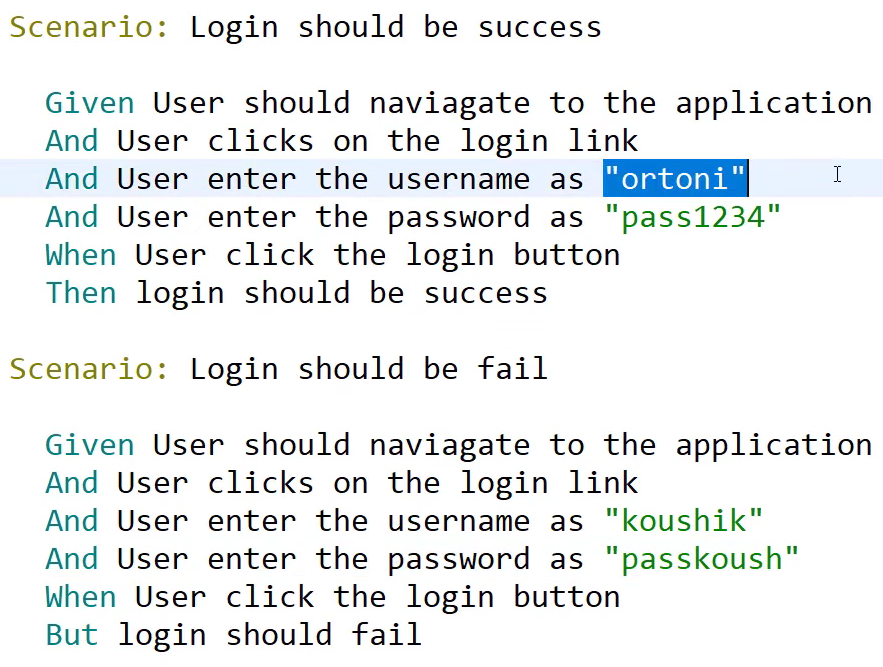
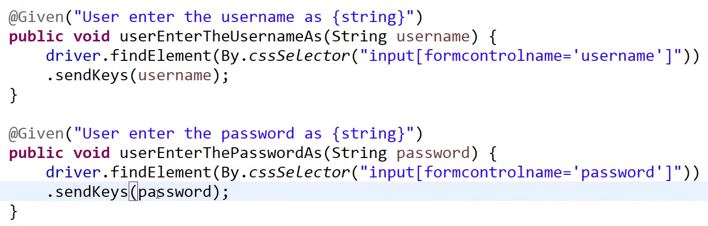
@And("User enters Deposit Amount {string}") -> string is datatype

## Scenario Outline:
Similar to Scenario but must have Examples.
Parameters must be "<username>".

Examples:
|username|password|book|

Cucumber doesnt care about if you use @Given or @Then etc. It only cares about the step sentence like @Given("User should navigate to page").
If you give @Given("User should navigate to page") twice, only one method will be created. Everytime we give: Given User should navigate to page, in feature file, it will call the one method, not create again.

## Output:


## Reports:
@CucumberOptions(
    plugin = {"pretty", -> When you execute Cucumber scenarios, the output is generated in the console by default. This output can be modified using the plugin option in @CucumberOptions. pretty gives more verbose. (Without pretty, you wont see the scenario, steps in console, you will see only java errors and Total tests run, passes, failures, skips).
    "message", -> machine readable format (NDJSON). Show order of execution of everything in the program.
    "usage", -> Gives time taken by each step definition. (will show aggregatedDurations, median and average).
    "progress", -> show F for fail, . for pass, U for undefined step def.

    (created files are saved outside src)
    "rerun", -> Can make a file (.txt) with only failed cases, you can then rerun only that.
        To rerun the failed tests: features = "@reports/rerun.txt",
    "html:reports", -> reports is folder name
    "json:reports/result.json", -> json reporter and file name
    "junit:reports/result.xml"}
)
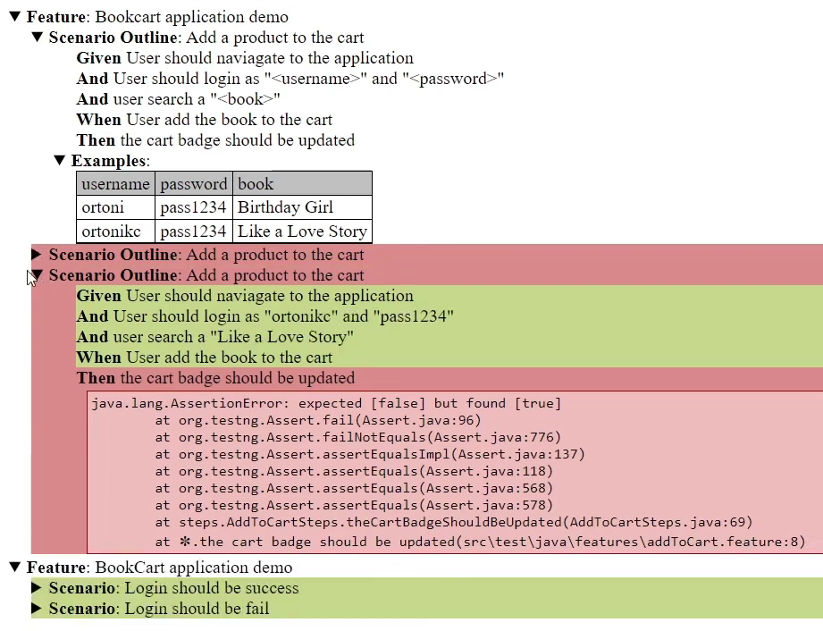 -> for production, it must also include screenshots.

### Reporter Plugins / Formatters:
Using these built in report plugins, you can make local reports:
message
progress
pretty
html
json
rerun
junit
testng

### Extent Report:
More pretty.

## Background:
Its like @BeforeMethod annotation.
Used for pre condition (driver init steps etc.)
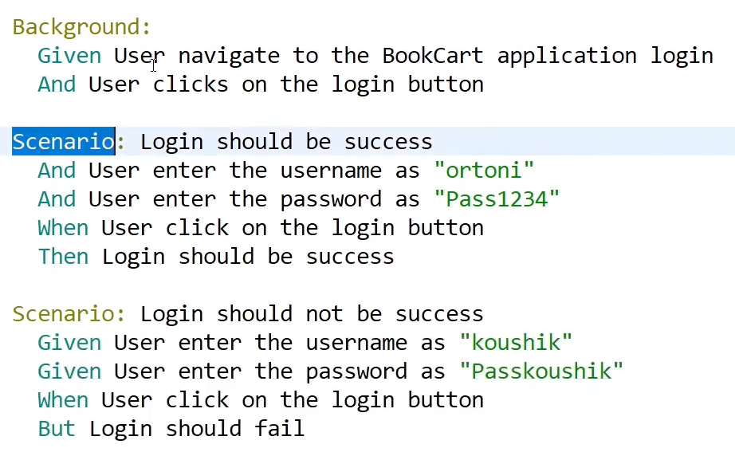

## Tags:
@CucumberOptions(
    tags = {"@smoke"}
)
only the step def method with @smoke annotation will run.
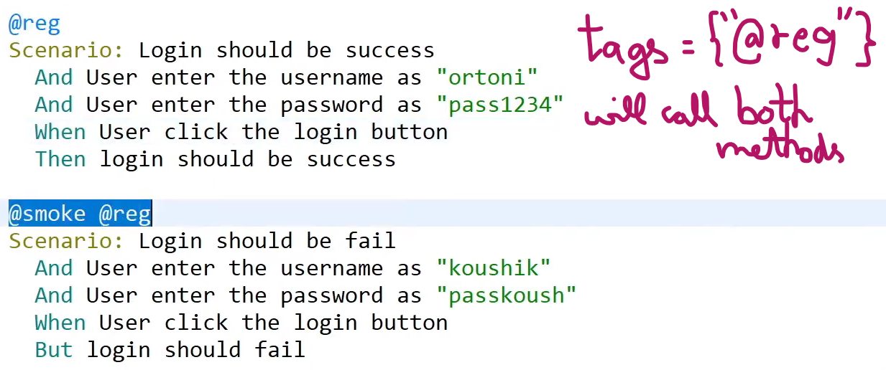
can also do {"@smoke and @reg"} -> method which has both the tags.
{"not @reg"}
tags can be used with Features, Scenario, and Examples too.

## Hooks (for screenshots, driver.quit() etc):
Must add it to glue.
Good practice is always to have one hooks class.

You can declare driver in a class and extend it to others too.

### BeforeAll, Afterall run outside scenario:
@BeforeAll, @Afterall: Static, no parameters.
@BeforeAll, @AfterAll(after all scenarios) (automatically detected and used with steps)

### Basic annotations:
#### order:
The annotations can take 'order' as argument. Default is 10000.
```
@Before(order = 1) -> executes 2nd
@Before(order = 0) -> executes 1st
```
For After, it is in reverse:
```
@After(order = 1) -> executes 2nd
@After(order = 2) -> executes 1st
```

@Before, @After,
@BeforeStep and @AfterStep are used with Scenario class as parameter, which allows methods like:
.getName(),

.isFailed(),

.write() -> write to report

.getId() -> returns path and line number.
    for Scenario: it returns line number of @Scenario tag.
    for Scenario Outline: it returns line number of each example inside @Examples.

.getLine() -> returns array.
    for Scenario: returns [8] -> line number of @Scenario.
    for Scenario Outline: returns [16, 6]
        16 -> example line number.
        6 -> line number of @ScenarioOutline

.getUri() -> same as getId(), but returns only path.

.getSourceTagName() -> gets the tags as array. Can write logic like if the method has this tag, do this.

Type - .getStatus() -> Its an enum.
Has:
PASSED
SKIPPED
FAILED
UNDEFINED : When the step def method is not yet completed.
PENDING : When step def is not written.
AMBIGUOS

Default Status of Scenario is PASSED.
It shows PASSED if used in @Before.

### Screenshot:
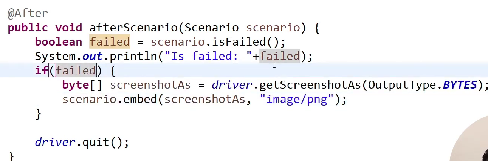
driver.getScreenshotAs works because he used:
RemoteWebDriver driver = new ChromeDriver();

### Hooks with tags (Conditional Hooks):
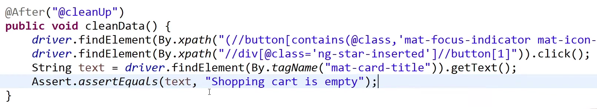
Tags can be used with Scenarios or Features, usually used to segregate @smoke, @sanity etc.
Can be used with @Before, @After, @BeforeStep, @AfterStep.
```
@Before(value = "@smoke") -> this before step will only run for Scenario or Feature with @smoke tag.
```

This hook method will execute only if the scenario has the tag @cleanUp.
Can be used to clean data after all scenario is completed.

## Cucumber Quirks:
0. Order of Initialization:
    RegisterSteps Constructor -> @Before -> Step Definition -> @After

1. Why @BeforeAll is unreliable for initializing driver?

## Framework:
Framework gives others functionalities that they can implement.

core
    listenters
        TestRetryListener -> Listener (whenever test fails, this runs?)
    util
        DataLoaders
    BasePage -> methods to abstract findElement, click, refresh etc.
    DriverManager -> Use ThreadLocal(set, get, unload must be added along with ThreadLocal)
    DriverFactory -> createChrome(boolean headless) (with headless mode options), createFirefox. All methods are static.
    Config -> methods to read config.property file.
    Hooks -> @Before (From @Before cucumber hook, we can call TestNG's @BeforeMethod), @After (same as @Before).
    BaseTest -> This has TestNG @BeforeMethod, @AfterMethod etc.
    pages
        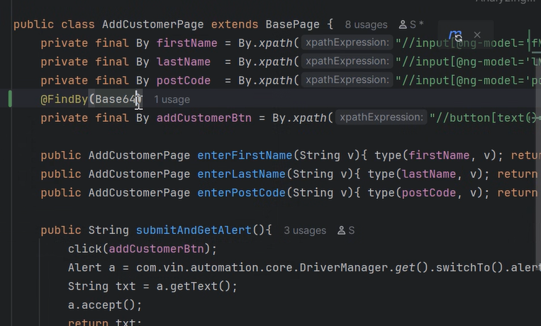
        Can use @Findby Page Factory or By locator. (By locator is advisable).
        Can also use @CacheLookup.
    runners
        BankTestRunner -> tags like @smoke (all functionality will have smoke test, you can use tag the smoke methods in each feature file).

resources
    data
    features
        config.properties -> has baseUrl, browser name, headless, wait time, screenshotonfailure.

## Interview Questions:
*Page Object shouldn't have Assertion. Assertion should be in test.
*How Page Object Model can be implemeneted for a page. Eg. Inside PIM page, there should be different tabs for Add Employee (which has its own firstName, lastName, id etc), Reports tab will have (reportId).
*@When user enters "json" -> can also give json to it (use class like json loader).
*Difference between CI and CD.
*compiler plugin, surefire plugin, cucumber-reports plugin.
*Use Github Actions (similar to Jenkins), which uses a yaml file to automate running programmes.
*Iterate html table in Selenium, sort it.
*Running each step of a Cucumber scenario in a separate thread is not supported. From Given to Then acts as an isolated test case. When running with cucumber, testng annotations like @BeforeMethod are ignored.