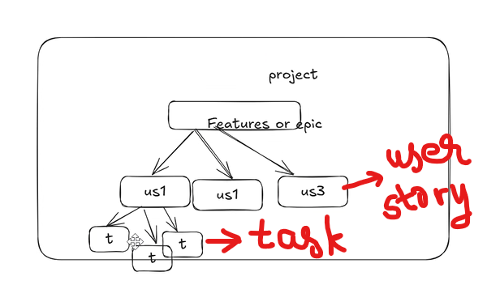
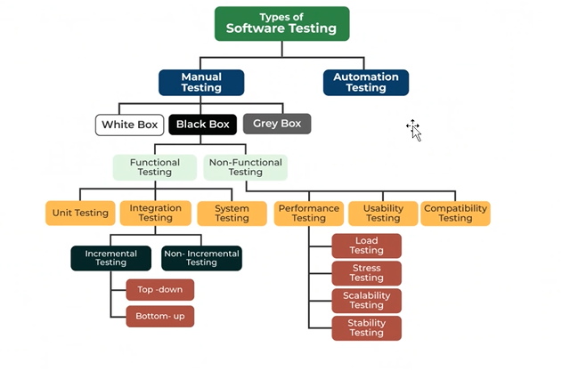
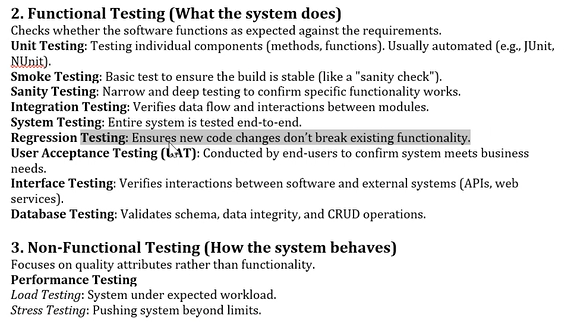
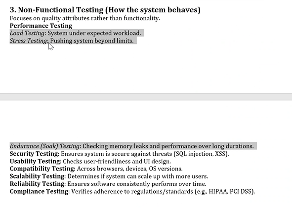
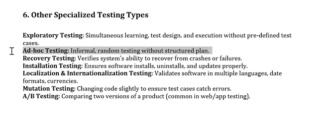
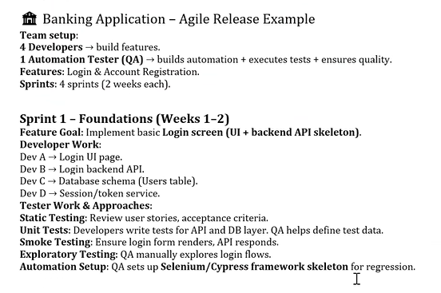
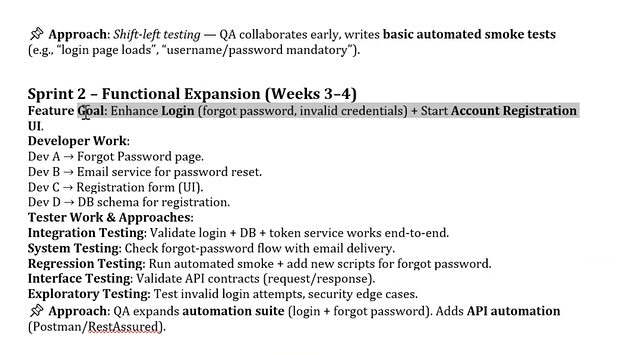
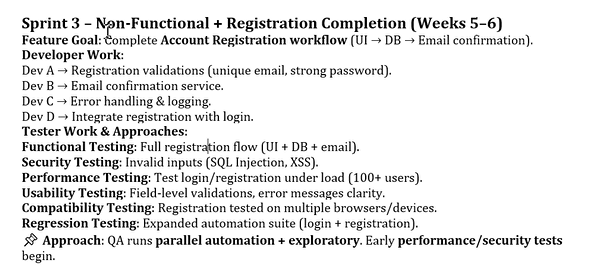
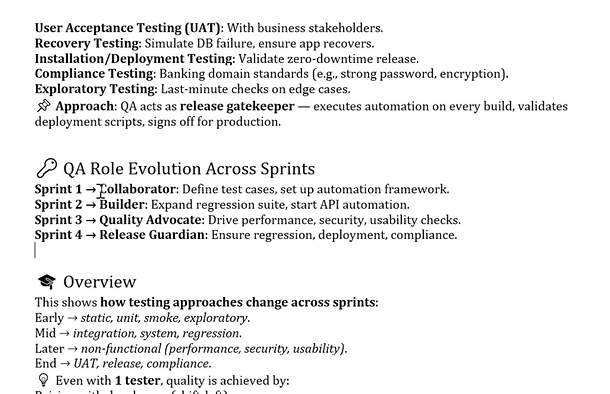
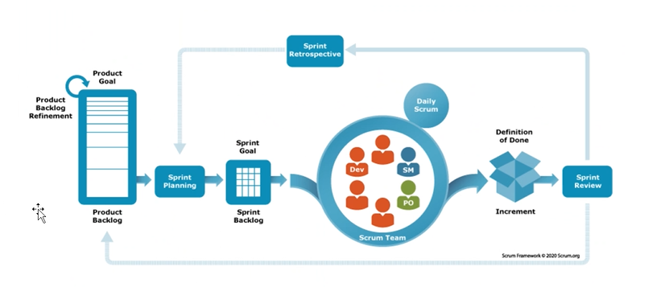

# Testing Notes

Software Testing:
Cost reduction
Security
Quality
Customer satisfaction

Static vs Dynamic Testing:
Stactic testing - during reviewing document phase.
Dynamic - actual testing where u do functional testing.

Integration testing:
If all your top modules are present, but not your bottom modules, you can use mock objects.
If all your bottom modules are present, but not your top modules, you can use drivers.

BVA (Boundary Value Analysis)

White box, black box, grey box testing:

Manual Testing:
Test Scenario ID
Test case ID
Test case desc
Steps to execute
expected results
actual results

defect id --> diff between expected and actual results

if you find a defect, tell dev how to reproduce the defect.

Defect Lifecycle: {
description
data
qa environment
steps to reproduce
expected and actual result
evidence

after dev fixes defect:
if the issues is fixed
if it impacts other things
}

In Jira, epic, task, bug, everything is work item.

1. Linked user story with epic.
2. Link task with user story.

Which should be prioritised? Severity or Priority? Ans: Severity

Testing types:

Functional testing: functionality

Equivalence partitioning and Boundary values analysis

notification - priority feature
    - email notification
    - sms notification

Smoke testing is done in highlevel. It will only involve one flow to test. Will touch up each component (high coverage) but not deep.

Sanity will check whether a particular module is working or not. Depth but not much coverage. Eg. payment module added, test diff payment methods.

Regression - test that newly added things dont affect others.